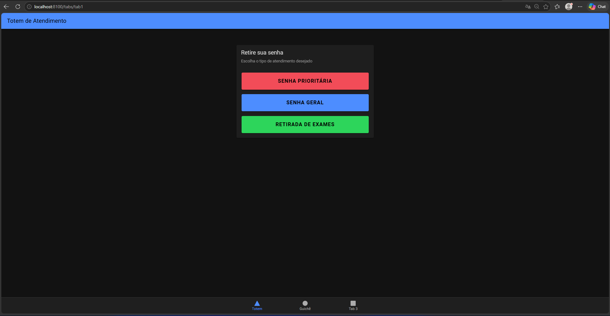
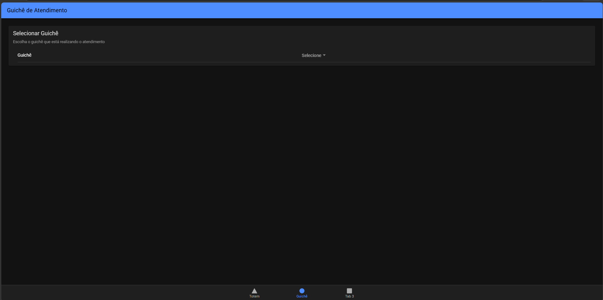
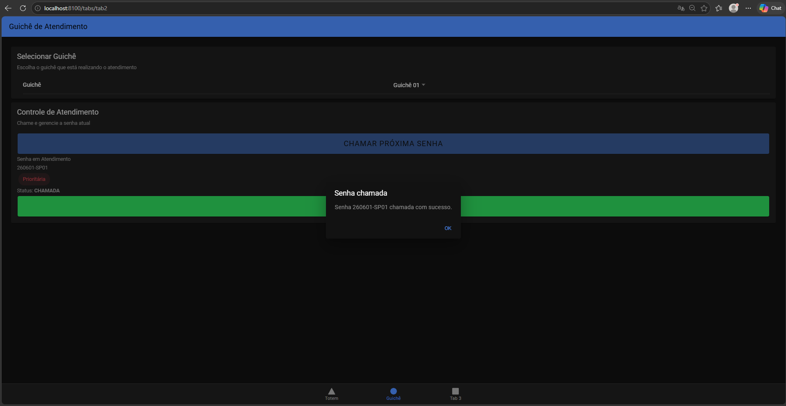
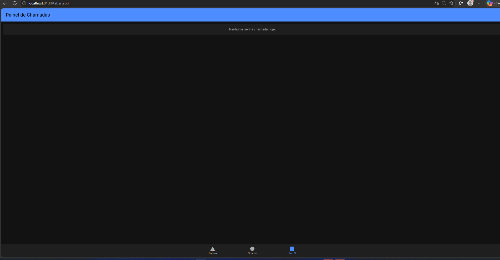

# MobileTicketsIonic
Sistema de Senhas - Laboratório Médico
Sistema MVP para gerenciamento de filas de atendimento em laboratório médico.
O projeto possui emissão de senhas, chamada por guichê, finalização de atendimento e painel de chamadas.

#Como executar o projeto
1. Clonar o repositório

    git clone [<url-do-repositorio>](https://github.com/ferreirascdb/MobileTicketsIonic)
    cd MobileTicketsIonic

2. Configurar o banco de dados

database.sql
No MySQL.

3. Configurar o backend

Entre na pasta do backend:

    cd backend
    Instale as dependências:

    npm install
    Crie um arquivo .env:

    env
    PORT=3000
    DB_HOST=localhost
    DB_USER=root
    DB_PASSWORD=sua_senha
    DB_NAME=lab_senhas

    CHECK_HOURS=false
Inicie o servidor:

    npm start

http://localhost:3000

4. Configurar o frontend
Entre na pasta do frontend:

    cd frontend
    Instale as dependências:

    npm install
    Execute o Ionic:

    ionic serve
    
    http://localhost:8100

Observações
    O formato da senha utiliza sequência diária com dois dígitos.
    A sequência é separada por tipo de senha.
    Apenas senhas com status EMITIDA podem ser chamadas.
    Apenas senhas com status CHAMADA podem ser finalizadas.
    O painel exibe as chamadas do dia atual.

#TELAS:

##TOTEM

##Guiche

##Painel

